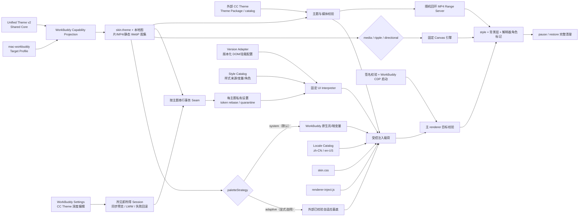

# 架构

## Monorepo 边界与稳定身份

Adapter 源码的唯一位置是 `adapters/mac-workbuddy`。公开 canonical 机器身份是 `mac-workbuddy`。
目录迁移不改变 WorkBuddy target、`.cctheme` 内的 `targets/macos-workbuddy/theme.json`，也不改变
公开制品命名规则。当前资产身份是 `mac-workbuddy-5.2.6-r1-macos-arm64`，源码与客户端 ZIP 分别为
`mac-workbuddy-5.2.6-r1-macos-arm64.zip` 与
`cc-theme-mac-workbuddy-5.2.6-r1-macos-arm64.zip`。

源码内路径从 Adapter 自身位置解析；跨 Module 依赖必须使用当前 monorepo 布局并由合同测试约束。
客户端 ZIP 中的 `.mac-workbuddy` 是发布 Implementation 的私有运行目录，与源码路径相互独立且刻意稳定。
构建只按发布白名单组装该目录，不复制 Adapter 工作树或相邻 Module。

Capability、Target Profile、Projector invocation/result、Locale/UI Surface Catalog 与 operation result 只发布
canonical ID。Adapter 不维护公开 alias。预发布本机状态如果只存在于旧目录，会在首次加载公共生命周期
脚本时验证 owner、拒绝符号链接、停止旧 injector、原子移动到 canonical 目录并规范化状态记录；若
canonical 目录已经存在，则旧目录不会被读取或合并。所有后续写入只进入 canonical 目录。

`skin.theme`、`workbuddy-skin` 根 class、`data-workbuddy-skin-*` 属性和 `workbuddy-skin-*` 自有节点是
renderer 内部协议。它们不出现在 Unified Theme target 选择或跨端 Adapter discovery 中，因此保持稳定，
避免无意义地破坏 CSS、DOM ownership 与清理逻辑。

## WorkBuddy 应用结构

WorkBuddy 5.2.6 是 Electron 应用，主要资源位于：

```text
WorkBuddy.app/Contents/
├── Info.plist
├── MacOS/Electron
└── Resources/
    └── app.asar/
        ├── main/index.js
        ├── preload/index.js
        └── renderer/
            ├── index.html
            └── assets/*.js, *.css
```

主进程创建 `BrowserWindow`，启用 `contextIsolation`、`sandbox` 和 `webviewTag`，关闭 `nodeIntegration`。适配器不尝试绕过这些边界，而是使用 WorkBuddy 主进程已经提供的本地 CDP 开关，从外部连接主渲染页。

## 适配器数据流



## 与 mac-codex 的对应关系

| mac-codex 机制 | mac-workbuddy 实现 |
|---|---|
| `skin.theme` 主题契约 | 保留同一 `kind`、色彩、字体和 appearance 基础字段 |
| CDP 注入 | 改为 WorkBuddy 环境变量和 renderer 身份校验 |
| 早期注入 | 只在版本化 Catalog 记录的本地 renderer 路径预注册载荷；已出现但冲突的宿主身份立即拒绝，完整 UI 协调仍等待严格 Surface 门禁 |
| MutationObserver 重标记 | 固定 UI Interpreter 读取 Version Adapter，统一处理角色、锚点、挂载点和动态 composer 目标 |
| pause / restore | 移除自有节点、样式、变量和 CDP 启动状态 |
| 独立 Hero / 宠物模块 | 不实现 |
| 背景视频 | 优先使用随机回环 Range 地址；5.2.6 媒体管线拒绝时在同一 generation 内使用受控 Blob 回退，图片作为海报和降级 |
| 水波 / 方向背景 | 复用同一安全契约与固定引擎；保持 WorkBuddy 根节点、UI 定位和清理生命周期独立 |

## 生命周期

1. `start-skin-macos.sh` 验证系统、bundle id、腾讯签名团队、应用完整签名和 Node 版本。
2. 以签名、完整 bundle 可执行路径和进程归属识别并清理旧 WorkBuddy 主进程/残留进程；不按 UI 名称匹配，也不触碰同名无关进程。
3. 安全停止旧 watcher 后，通过 launchd `RunAtLoad` 启动唯一长寿命 watch injector 和其媒体服务；不再追加会触发十秒节流的强制 `kickstart`。
4. 通过 `WORKBUDDY_REMOTE_DEBUGGING_PORT` 启动或复用 WorkBuddy，并确认端口监听进程属于 WorkBuddy 进程树。
5. watcher 校验 Version Adapter、Style Catalog 和 Locale Catalog，只向 Catalog 记录的主 `file://` renderer 路径预注册载荷。此阶段允许 WorkBuddy 的身份 dataset 尚未填充，但任何已填充且不匹配的身份值都会 fail closed；角色协调、Settings 挂载和最终 verify 仍要求完整 dataset 与 Surface selectors。
6. `media`、`ripple` 与 `directional` 在主题归一化阶段确定且互斥；方向图集先完成容器、尺寸、网格和动画检查，再以 1 MiB 有界 CDP 分块传入 renderer-local Blob。
7. 视频优先直接连接受信回环 Range URL。WorkBuddy 5.2.6 若在媒体请求前以 `MEDIA_ERR_SRC_NOT_SUPPORTED` 拒绝该 URL，renderer 会在同一 watcher、同一 revision、同一 install generation 内从已验证端点读取 MP4，并在严格 content-type/content-length/最终 Blob 大小检查后切换为页面内 Blob URL；诊断固定为 `direct-media-source-unsupported`，pause/替换时撤销 URL。
8. 启动 verify 对可见且非 Reduced Motion、非用户暂停的视频要求 `videoReady=true` 且 `playing`，不接受 `loading`。前台交接必须得到系统确认；后台、Reduced Motion、用户暂停和 disabled 分别产生结构化降级，不伪装为播放成功。报告只保存净化、有界的各阶段耗时和媒体状态。
9. watcher 首代完成后继续监控 CSS、固定背景引擎、renderer 模板、Catalog、主题或图片变化，并在必要时热替换 generation。这个 `revision` 是进程/会话作用域的运行标记，不是源码或发布制品摘要。
10. Settings 打开时，UI Interpreter 从 Version Adapter 解析导航、内容与原生面板挂载点，并以紧邻的原生条目为 class、role、tabindex 和交互状态参考，创建自有 ownership 的 `CC-Theme` 项；不复制原生事件、不修改相邻节点。切回任何原生项或暂停适配器时恢复原生面板。
11. 外部 `.cctheme` 由 Manager 或显式命令进入验证与 staging Seam；Adapter 不发现、制作或展示生产主题库，也不携带默认主题。
12. Settings 控件只投影 Style Catalog 白名单。每次有效变化先由 Interpreter 同步预览，再经短防抖和单调 revision 写入每主题私有设置文件；旧异步写入不能覆盖新值，失败统一回滚页面、内存、renderer 与磁盘状态。
13. Manager apply 和本地 Settings 写入共用 `adapter-transaction.mjs` 的按主题跨进程锁。Manager 更新 base hash 后，旧 renderer 的迟到写入会失败并回滚；重新加载时按稳定 token ID 与控件指纹重放兼容覆盖，不兼容值进入哈希化隔离并给出本地化提示。
14. `pause` 清理自有节点和角色，取消 RAF/定时器/监听器，释放 WebGL 与 Blob URL，并恢复注入前已有的内联变量；`restore` 进一步正常重启 WorkBuddy，以关闭调试端口。无有效外部输入时保持宿主原生状态。

主背景图片使用受控 `` 节点，而不是超长 inline CSS 变量。WorkBuddy 当前 Chromium 对约 2.2 MB 的 Base64 自定义属性会静默丢弃，而图片 `src` 可以稳定承载同一份已校验本地媒体。

### Renderer generation 与发布溯源

`injector.mjs` 输出的 `revision` 固定声明为 `revisionScope: renderer-session-generation`。它同时覆盖当前 renderer 内容和本次 injector 进程的会话 generation；相同源码由两个不同 injector 进程加载时允许、并预期得到不同值，不能把某次 QA 的 revision 作为 Manager 重建门槛。

renderer session nonce 的职责是隔离不同 injector 进程并使旧 generation 失效；Settings nonce 只保护当前自动保存会话。热更新 revision 让同一进程在 CSS、固定引擎、Catalog、主题或媒体变化时替换 renderer。它们不承担确定性发布身份。

确定性发布溯源使用 Release 文件清单、包内文件或最终归档的 SHA-256；preflight 的 `releaseTraceability: file-manifest-sha256` 明确这一口径。Manager 可以记录自己那次 preflight revision 用于同一运行会话诊断，但跨进程或跨重建比较必须使用 SHA-256。

### Adapter 版本轴与修订轴

`PROJECT_MANIFEST.json` 是发布身份的机器源。公开 `adapterVersion` 严格等于受支持宿主的
`CFBundleShortVersionString`，当前为 `5.2.6`；精确 build 只保存在 `host.compatibilityEvidence` 与
Manager compile context，不能拼入版本号。同一 ShortVersion 下的修复使用正整数
`adapterReleaseRevision`，当前为 `1`。Capability、三个 Catalog、package contract 和 release manifest
必须与该身份一致，否则构建在组装前失败。构建以原子 lock 协调。当前 r1 被机器清单明确标记为
`unpublished-development`，因此 Manager prepare 可以原位原子重建且旧摘要立即失效；首次正式发布时
切换为不可覆盖策略，此后同 revision 的 ZIP 或 SHA-256 sidecar 已存在即 fail closed。

`appearance.paletteStrategy` 将颜色来源与背景媒体解耦。`system` 以 WorkBuddy 当前亮/暗模式为 authority，renderer 不桥接覆盖 WorkBuddy 的 `--wb-*` / `--cb-*` 原生变量。`adaptive` 只消费外部投影已经验证的自适应颜色；Adapter 不制作或分析生产主题媒体。`custom` 消费目标 Schema 白名单内的显式颜色。旧主题未声明该字段时归一化为 `custom`，避免升级后覆盖其已有设计。

## 发布边界

生产主题、媒体、poster、可安装包和 catalog 归独立 CC Theme 资源层所有。Adapter 源码与客户端构建都通过 `contracts/adapter-release-manifest.json` 显式组装，仅发布固定解释引擎、Catalog、兼容证据、验证器和生命周期 Seam。发布扫描拒绝生产主题目录、主题文档、安装包和媒体；失败回退始终是 WorkBuddy 原生状态。

## 四方数据契约

`contracts/adapter-capability.json` 是 WorkBuddy 映射事实的机器源，`contracts/target-profile.schema.json`
是统一入口可写字段的唯一白名单。`scripts/workbuddy-theme-projection.mjs` 接受 Unified Theme v2，
把 Shared Core 逐字段投影成严格 `skin.theme`，同时返回 exact/approximate/unsupported 诊断和
apply 兼容结论；v1 只保留向后读取并给出迁移诊断。精确客户端版本、Surface Catalog 版本和
probe 结果只属于 capability/编译上下文，不写进主题设计数据。

Manager Projector 的 compile-context Interface 与 Manager Rust 固定序列化形状一致，共 9 个键：
`detectedClientVersion`、`detectedClientBuild`、`surfaceCatalogId`、`surfaceCatalogVersion`、
`probeStatus`、`compileAllowed`、`applyAllowed`、`reasonCode`、`localRuntimeOverrides`。共享合同向量保存在
`tests/fixtures/manager-rust-build-compile-context.json`，回归测试要求全部键同时出现，防止简化 fixture
再次掩盖字段漂移。

`detectedClientBuild` 接受 `null` 或 1–80 字符安全字符串；`surfaceCatalogId` 接受 `null` 或 1–128
字符安全 catalog ID。WorkBuddy 5.2.6 当前只按 `detectedClientVersion` 与 `surfaceCatalogVersion` gate
决定 apply，因此 build/catalog ID 会被显式验证后忽略；它们不会进入 Shared Core、目标 `skin.theme`
或 renderer。未知 compile-context 字段和非法类型继续 fail closed。

配色优先级固定如下：

- `system`：WorkBuddy 原生系统色是当前基底；Shared Core 颜色经过校验但保持休眠意图，本地覆盖不被删除。
- `adaptive`：Shared Core 建立自适应基底，Target Profile 选择策略，本地白名单覆盖最后生效；独立适配器当前只执行已提供的基底，不自行分析媒体。
- `custom`：Shared Core 是初始值，Target Profile 选择策略，本地细粒度颜色最后生效。

`surfaceCode`、`borderStrong`、`selectedHoverSurface` 仅在对应精确 WorkBuddy token 缺失时近似；
`success`、`warning`、Hero 媒体、最小对比度审计和透明度系统偏好当前明确不支持并产生可见诊断。
Reduced Motion 由固定运行时安全层精确强制为静态，系统模式的原生 focus 表现与自定义模式的
语义 focusRing 形成已声明的近似映射。

`background.position` 是当前背景图像/媒体的权威位置；旧
`tokens.appearance.backgroundPosition` 只作为带可见诊断的 fallback。两者冲突时 projector 在目标
Schema 和 Normalizer 之前以 `conflicting-background-position` 停止。图像、视频、poster、Reduced Motion
静态 fallback 和互动背景统一消费 `appearance.backgroundPosition`；Target Profile 不再公开视频专属位置，
避免第二写入口与静默丢字段。宿主 effective light/dark mode 始终优先，Shared Core
`shellMode` 明确不支持并诊断；renderer 不再把一个无视觉效果的数据属性冒充 exact 消费。

`actionPressed` 的 exact 通道只连接版本化 Surface Catalog 已记录的 `scene-tab` 和
`account-plan-action` pressed 状态。system palette 与背景 disabled 状态保持宿主原生；反向合同测试确保
每个 exact Shared Core paint binding 都有真实 CSS consumer，防止 Catalog 接受但视觉层不消费。

可选 MP4 不进入注入 payload。Watch injector 在 `127.0.0.1` 随机端口创建带随机路径的临时 HTTP Range 服务，只提供当前已验证视频；文件状态变化时拒绝继续读取。renderer 优先把该 URL 直接作为 `<video src>`；WorkBuddy 5.2.6 当前在发出媒体请求前拒绝此来源，因此固定引擎会在同一 generation 内使用受控 fetch→Blob 回退并公开诊断，不启动第二个 watcher 或静态首代。主题切换和暂停会中止读取并撤销 Blob。视频节点固定静音、循环、不可交互，并遵守 Reduced Motion 与页面可见性。颜色、位置和遮罩仍完全由主题与 CSS 控制。

互动背景 Canvas 位于 `#workbuddy-skin-background` 内、`#root` 之下，固定 `pointer-events: none`，不参与任何应用布局。方向模式只有方向扇区变化才重绘；水波能量衰减后停止 RAF。页面隐藏、窗口失焦或 Reduced Motion 生效时引擎停止动态更新，方向模式回到 idle frame，水波显示静态底图。资源或图形上下文失败时隐藏 Canvas，继续使用主题 `image`。

## 固定解释架构

`assets/ui-interpreter.js` 是唯一的解释模块。它的 Interface 只包含宿主验证、目标解析、挂载、角色协调、样式绑定和清理；它不包含 WorkBuddy 类名、中文文案或某个主题的颜色。

- **Version Adapter**：`compatibility/workbuddy-macos/<version>/ui-surface-catalog.json` 的 `runtimeInterpreter` 保存宿主身份、DOM targets、锚点、Settings 挂载关系和原生展示类名；`runtimeRoles` 保存 DOM 到 Skin Surface Role 的映射。
- **Style Catalog**：`contracts/theme-style-catalog.json` 保存语义来源到 CSS 变量及角色的连接，声明 `geometryPolicy: native`。renderer 只能提交已归一化的 palette/layout/host 来源，不能直接写根节点样式。
- **Settings Control Catalog**：同一 Style Catalog 的 `settingsControls` 把允许编辑的主题、配色、颜色、字体、透明度与背景参数连接到 paint binding；设置页不能新增选择器、CSS/JS 或任意 DOM 写值。
- **Locale Catalog + Locale Runtime**：`contracts/theme-settings-locales.json` 只保存 WorkBuddy 实际可选的
  `zh-CN / en-US` 文案、BCP 47 别名、方向和数字格式；`assets/theme-settings-locale.js` 只解释
  Version Adapter 提供的 effective locale。authority 是宿主持久化键，`body[lang]` 是即时信号；不读取
  系统语言、DOM 文案或用户内容。切换只同步重建皮肤自有展示节点，`theme-settings-session.js` 不重建，
  因而待落盘的安全修改不会丢失。翻译不参与宿主节点定位。
- **Runtime Settings Session**：`assets/theme-settings-session.js` 负责即时预览、短防抖、latest-write-wins、generation 隔离和失败回滚；`scripts/theme-runtime-settings.mjs` 只持久化通过 Catalog 校验的每主题状态，并以私有权限原子替换。
- **CSS Implementation**：`assets/skin.css` 继续只绘制角色和自有节点。DOM 版本变化更新 Version Adapter，视觉 token 变化更新 Style Catalog，解释规则变化才修改 UI Interpreter。

`injector.mjs --inspect` 的 Live Surface Evidence 只输出稳定标签/类、语义角色、父子结构、计数、几何、交互状态与必要计算样式。它不采集页面文字、输入值、accessible name、窗口标题、URL/query/hash、链接或媒体来源。升级修复先区分 Adapter 地标失败、主题契约失败和视觉验证失败；选择器只更新到版本化 UI Surface Catalog，绝不写回主题。
