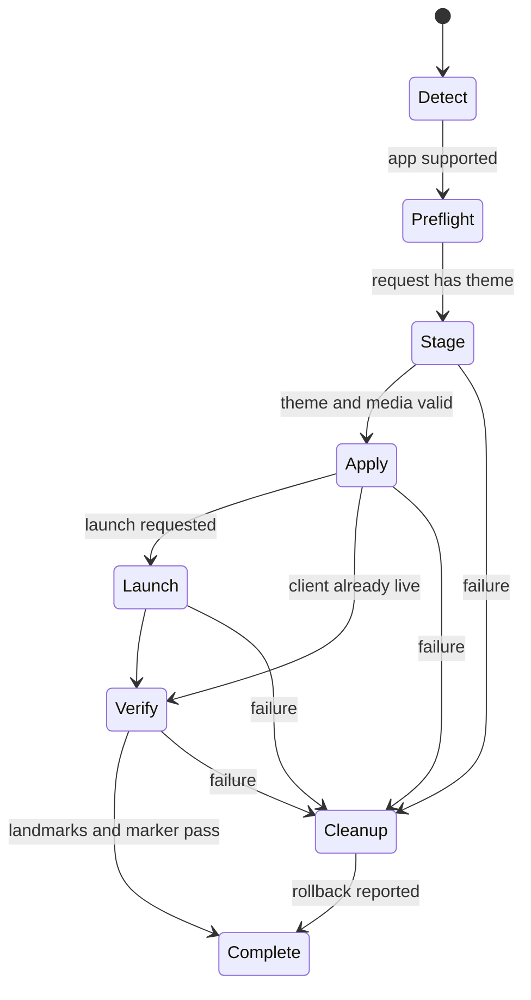

# 桌面管理器与 Skin Adapter 生命周期

## 管理器协议

Theme Manager 先通过仓库根目录的 `app/registry/adapter-capabilities.json` 与 Adapter SDK 发现目标并
生成可用操作，再由 Rust 桥接层把前端请求限制为固定 `ClientOperation` 和稳定 `OperationResult`。
`requestId` 用于界面进度、日志关联和防止旧响应覆盖新状态，不是授权凭据。前端不能提供脚本、
路径、参数或环境变量；Manager 也不得因为客户端已安装就绕过 Capability 的 apply gate。

统一操作为：

- `detect`：定位目标应用，读取版本、签名和运行状态；
- `preflight`：检查版本、运行时、固定 Injector、主题和 transport；
- `install`：把主题家族的目标产物验证并安装进 Local Theme Library；
- `apply`：原子切换已安装主题；
- `launch`：以适配器固定参数启动目标客户端；
- `apply-and-launch`：管理器编排的 apply → launch → verify 事务；
- `verify`：验证进程、transport、UI landmark 与主题运行标记；
- `pause`：保留已安装主题但停用固定注入；
- `restore`：恢复官方外观，可选择清理固定引擎。

底层已有脚本名称、阶段和结果格式可以不同，但桥接层必须规范化为统一 Schema。统一层不把
任意命令、路径、环境变量或客户端启动参数暴露给主题或前端。

当前只有 CodeX 与 WorkBuddy 注册。它们的写操作只有在各自 runtime probe、兼容证据和串行事务
Seam 可用时才能执行；未注册目标不存在运行操作入口。

## 事务状态

`apply-and-launch` 不是适配器中的一条任意 Shell 命令，而是管理器持锁执行的组合事务。任何
阶段失败都必须返回失败阶段、稳定错误码和可读信息；如果回滚不完整，状态为 `partial` 且
错误码为 `cleanup-incomplete`。

## 结果与隐私

成功结果强制 `status: "success"`、`ok: true`、`code: "ok"`；失败结果强制
`status: "failed"`、`ok: false` 且错误码不能是 `ok`。`details` 只允许应用、客户端版本、
主题 ID、进程/transport 状态、验证状态和有界警告。

不要在结果中包含用户对话、素材字节、访问令牌、完整 HOME 路径、进程环境或未经清洗的
命令输出。详细本地诊断若确有需要，应写入权限为 `0600` 的本地报告，并在界面中由用户主动
选择导出。
