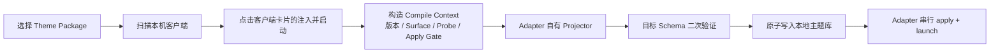

# Unified Theme 第一版架构

## 用户流程

CC Theme 是本地主题工具界面。启动后先扫描本机已安装客户端，用户选择主题后直接在
任一客户端卡片执行“正常启动”或“注入主题并启动”。卡片动作本身确定 Adapter，不再维护目标
勾选或“所选目标”中间状态。主要状态、主题、客户端操作和当前诊断在默认窗口内同时可见。

主题选择与客户端扫描互不依赖：主题可以留在中央主题库中，Adapter Engine 也可以独立升级；
只有用户选择的 `theme family id + adapter id` 组合才进入编译与应用流程。

## 所有权与对象边界

`cc-theme.unified-theme` 只拥有跨客户端稳定的 Shared Core、目标选择和按 Adapter 权威 ID
命名空间保存的 Target Profile。它不拥有宿主 DOM、选择器、注入、进程、启动参数或真实版本
事实。当前注册的 macOS Adapter ID 为 `mac-codex`、`mac-doubao` 与 `mac-workbuddy`。

每个 Skin Adapter 独立发布 Capability、Target Profile Schema、Style/Surface Catalog、投影器、
目标 `skin.theme` 校验器和串行事务 Seam。Manager 只发现、规范化并调用这些接口，不重新解释
宿主映射，也不因客户端名称相似而继承另一目标或另一操作系统的能力。

## 数据层与覆盖顺序

1. Shared Core：主题身份、语义颜色、字体角色、有限 appearance、背景模式和无障碍策略；
2. Target Profile：按权威 Adapter ID 命名空间保存，并由该 Adapter 发布的白名单 Schema 验证；
3. Local Runtime Overrides：只由宿主 Settings → CC Theme 深度编辑，以稳定 token id 与 base hash
   持久化；
4. 运行时无障碍与宿主安全降级拥有最终优先级。

统一入口重新编译主题时不能静默清空本地深度定制。base hash 变化后，Adapter 必须返回 preserve、
replay 或 quarantine 决策；不兼容值要隔离并提示，未发布安全事务 Seam 的写操作必须阻断。

任何层都禁止 CSS、JavaScript、HTML、Shader、选择器、命令、URL、任意路径和宿主版本事实。
未知字段 fail closed；可选 unsupported 字段可以省略但必须显示诊断，approximated 映射必须标识，
必需字段 unsupported 必须失败。投影产物仍须通过目标 Adapter 的 normalizer/Schema 二次验证。

## Registry、Capability 与应用门禁

仓库根目录的 `app/registry/adapter-capabilities.json` 是 Manager 的注册
发现入口。Registry 指向 Adapter 自己发布的 Capability、Projector、Catalog 和输出位置；主题
编译与界面能力不在多处维护客户端列表。

Capability 至少表达 Adapter 身份、可用状态、契约/目录版本、Shared Core 字段的
exact/approximated/unsupported 决策、Target Profile 白名单、可编辑本地 token、兼容策略和
apply 可用性。Manager 可以将不同来源声明规范化为统一读模型，但不能补猜缺失的宿主能力；
必需声明缺失时 fail closed。

未注册目标不参与扫描、界面、编译、打包或运行资源。保留在仓库中的 Adapter 源码不等于
Manager 产品能力；重新接入必须重新发布 Capability、运行 Seam 与真实 QA 证据。

精确客户端版本、Surface Catalog 版本、probe 结果和 apply 决策只存在于
`app/packages/contracts/compile-context.schema.json` 或 Adapter Capability，
不写回主题设计数据。宿主 Settings 的国际化也由 Adapter 声明和实现；共享 Theme Family 不
携带宿主界面翻译。

Manager 自身窗口的中文/English 文案由 Manager i18n Catalog 维护。主题卡片的名称和简介不属于
宿主 UI 翻译，而属于 `.cctheme` 的 `family.json.metadata.locales`；当前标准包要求至少提供
`zh-CN` 与 `en-US`，显示时按当前 Manager 语言、英文、包默认语言和统一主题 fallback 的顺序
选择。两者都不能进入 Shared Core，也不能覆盖 Adapter 对宿主 Settings locale 的所有权。

## 运行时编译与完整性

Theme Package 是中央主题库对象；Adapter Engine 是独立可执行组件。两者通过
`theme family id + adapter id + capability version` 关联，并分别记录版本与摘要。Adapter 自带
生产主题或媒体不是 Adapter Engine 的一部分，也不是运行时编译的隐式数据源。

`.cctheme` 是 ZIP 兼容容器但不是任意 ZIP：根目录固定为 `family.json`、
`unified-theme.json`、`assets/<安全 basename>`。Manager 在导入阶段限制压缩包大小、文件数、
单文件与解压总量，拒绝目录穿越/符号链接/重复条目，校验媒体 magic、清单字节数和 SHA-256，
再原子安装。语义数据在目标 apply 前仍须通过 Shared Core 与 Adapter 的二次验证。

当前过渡安装包内置固定版本的 Adapter Engine、编译器、运行时和 Capability Registry，但不内置
生产主题或主题媒体；全新安装的主题库为空。最终最小化架构再把 Adapter Engine 改为用户选择
客户端后按需下载的独立签名组件。

Adapter 的独立版本与分发由 [ADR-0001](adr/0001-adapter-distribution.md) 定义。Adapter Release
Catalog 只描述可获取的版本，`.ccadapter` 只承载 Engine；两者都不能覆盖本机 Capability、真实
Compile Context 或 apply gate。安全安装、原子切换和回滚在第三阶段启用前，Manager 继续使用
bundle 内的 last-known-good Engine。
运行时流程为：

1. 验证 Theme Package 清单、统一主题文件和素材的 SHA-256 与有界路径；
2. 根据本机扫描结果与 Capability 构造 Compile Context；
3. 通过 Registry 调用 Adapter 自有 Projector；
4. 对目标 `skin.theme` 做安全白名单和目标 Schema 二次验证；
5. 只把用户选择的目标与共享素材原子发布到本地主题库，再调用对应事务。

因此，最终用户不需要 Node.js、Rust、Homebrew、命令行工具或源码检出。开发工具只用于构建
安装包，不是应用运行依赖。

## 唯一主题结构

当前产品尚未公开发布，因此主题资源不维护多套公开格式。`schemaVersion: 1` 就是唯一的
Unified Theme 结构：使用 `sharedCore`、权威 Adapter ID 数组和按 Adapter 命名空间保存的
`targetProfiles`。主题作者、example、打包器和 Manager 都只写出这一版。
此前未发布草稿不属于兼容范围；打包器和 Manager 均直接拒绝，避免形成第二套事实来源。

## 扩展边界

新增目标继续通过通用 Registry 与 Capability 接入，不保留已移除目标的占位卡或特殊判断。
Windows 全线当前为 `paused-by-user`：Manager 不注册 Windows Adapter、不实现、不测试，也不从
macOS Adapter 推断 Windows 可用性。只有用户明确恢复 Windows 开发后才重新进入接口评审。

## 跨 Adapter 验收基线

- 同一输入确定性生成各已注册目标的 golden artifact，并通过对应 normalizer；
- Capability 决策与投影结果一致，WorkBuddy 不序列化实现未消费的 semantic key；
- required、optional、approximated 与 unsupported 都产生正确结果和诊断；
- 禁止载荷、未知字段、URL、绝对路径、路径穿越以及摘要不匹配均被拒绝；
- stable token/base hash 的 preserve、replay、quarantine 与缺失事务 Seam 阻断都有交互测试；
- 第一版主题不携带宿主版本事实，Theme Package 不依赖 Adapter preset；
- 主界面主要操作在默认窗口内可见，客户端不可用时按钮关闭但原生启动边界清楚；
- 发布包在没有开发环境和源码仓库的干净 Mac 上完成扫描、编译、应用、启动与恢复验收。
